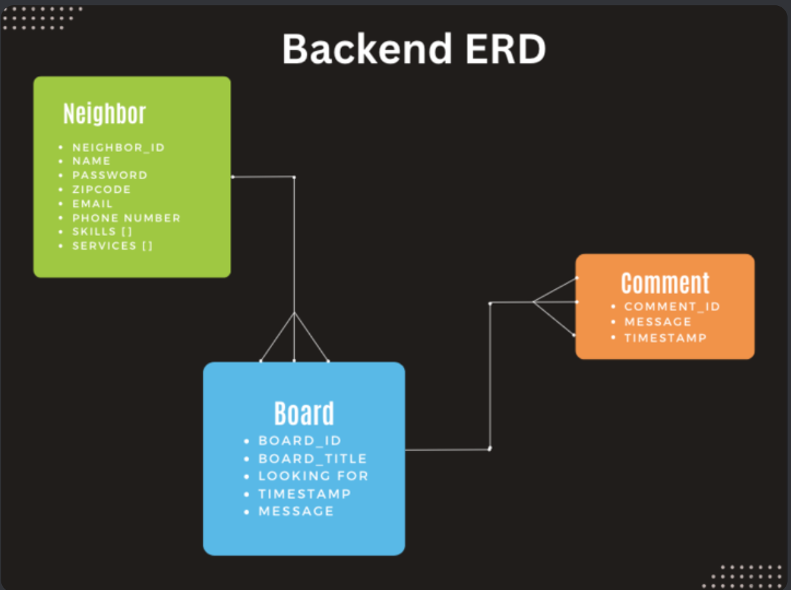

# neighborhood-hack-backend

# Project Overview

This is the backend server for the Neighborhood Hack project. It is responsible for handling API requests, managing the database, and serving data to the frontend application.

# Entity Relationship Diagram (ERD)


# Description of Files:

models/: This directory contains the database models defined using an ORM. Each model represents a table in the database and provides methods for querying and manipulating data.

routes/: This directory contains the route handlers for various API endpoints. Each route file defines the routes and their corresponding controller functions for handling incoming requests.

# Installation
To set up the Neighborhood Hack Backend server, follow these steps:

## Prerequisites
Make sure you have the following software installed on your system:

Python (version 3.8 or above)
npm (Node Package Manager) or yarn
## Step 1: Clone the Repository
Clone the repository to your local machine using the following command:

bash
Copy code
 `git clone https://github.com/LeeReyesCS/neighborhood-hack-backend.git`
## Step 2: Navigate to the Project Directory
Navigate to the cloned project directory using the following command:
`cd neighborhood-hack-backend`
## Step 3: Install Dependencies
Install the project dependencies by running the following command:

`npm install`
or if you're using yarn:
`yarn install`

## Step 4: Configure Environment Variables
Create a .env file in the project root directory and configure the following environment variables:

```SQLALCHEMY_DATABASE_URI=<your_database_host>```
```JWT_SECRET=<your_jwt_secret>```


Make sure to replace <your_database_host> and <your_jwt_secret> with the appropriate values for your setup.

## Step 5: Run the Server
Start the server by running the following command:


`npm start`
or with yarn:

`yarn start`
The server will start running at http://localhost:5000 by default.

Congratulations! The Neighborhood Hack Backend server is now installed and running on your local machine. You can proceed to set up the frontend application and start using the Neighborhood Hack project.


# Contact
If you have any questions or need further assistance, please feel free to contact the project maintainers: Anjulah Tamang, Christian Mojica, Farrah Unger, [Lee Reyes][1], Michelle Oh.

Thank you for using the Neighborhood Hack Backend!

[1]: https://www.linkedin.com/in/lee-reyes/


